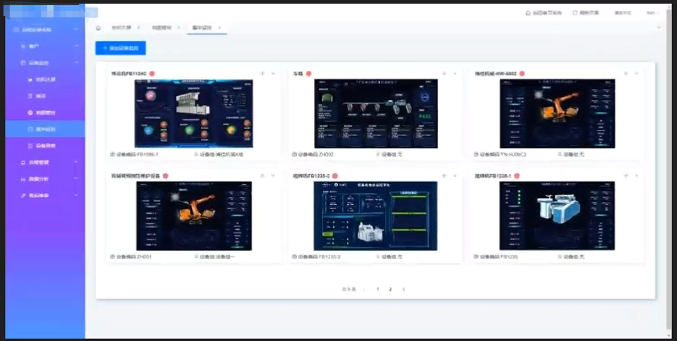
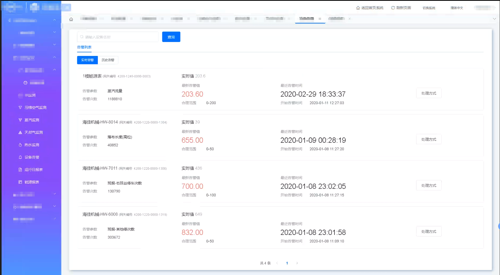
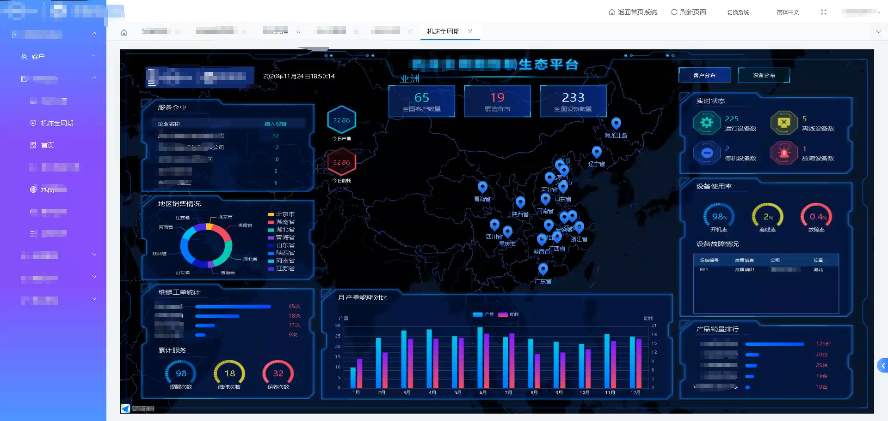
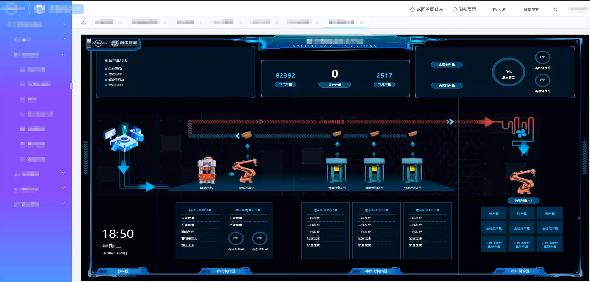

A ¥120,000 Manufacturing System: Full Retrospective from Requirements to Delivery (Looking for Your Feedback)

This was my very first development project. The client needed a system that could display 3D models and present them as different types of dashboards/boards. Users could click into different boards, and it also included dimension drawings.

The client was a mid-sized company that manufactures small home appliances. The development took about six months, and the total fee was RMB 120,000.

Looking back now, it’s still pretty interesting to see what I built. If you’ve worked on similar projects, feel free to jump in—I'd love to hear about your first project, too.

联系：13537399880

